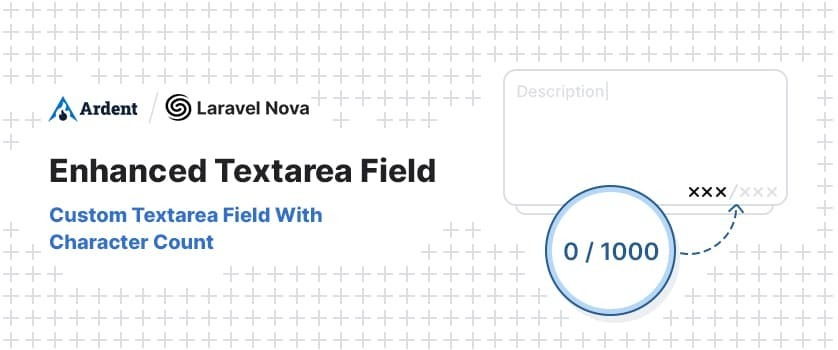
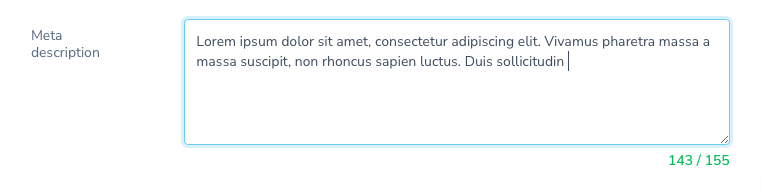
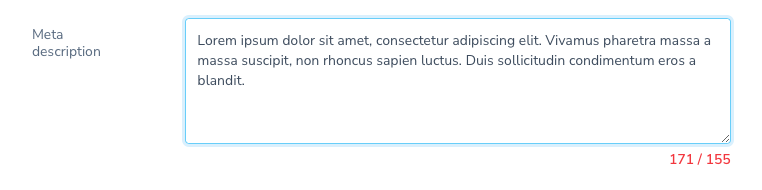

# Laravel Nova Enhanced Textarea Field

<p align="center">
    
</p>

> A custom Textarea Field for Nova with character count

[](https://packagist.org/packages/ardenthq/nova-enhanced-textarea) [](https://packagist.org/packages/ardenthq/nova-enhanced-textarea) [](https://packagist.org/packages/ardenthq/nova-enhanced-textarea)

## Features

- For Laravel Nova ^4.0
- Character count and maxLength warning

<p align="center">
    
    
</p>

## Installation

```console
composer require ardenthq/nova-enhanced-textarea
```

## Use

1. Add the `EnhancedTextarea` field to your Nova Resource.

2. Call the `->maxLength()` method to define the max number of characters that the field should show.

```php
<?php
namespace App\Nova;

use Laravel\Nova\Http\Requests\NovaRequest;
use Laravel\Nova\Resource;
use Ardenthq\EnhancedTextarea\EnhancedTextarea;

final class ResourceName extends Resource
{
    // ....
    public function fields(NovaRequest $request)
    {
        return [
            // ....
            EnhancedTextarea::make('Description', 'description')
                ->rules('nullable', 'string', 'max:1000')
                ->hideFromIndex()
                ->maxLength(1000),
                // ...
        ];
    }
    // ...
}
```

## Development

1. Run `yarn nova:install` and `yarn install` to install all the necessary dependencies for compiling the view components.
2. Run `yarn run dev` (or `yarn run watch`) while making changes to the components in your local environment.
3. If you change the vue components, ensure to compile for production before making a PR.

### Compile for production

1. Run `yarn nova:install` and `yarn install` to install all the necessary dependencies for compiling the view components.
2. Run `yarn run production`.

### Analyze the code with `phpstan`

```bash
composer analyse
```

### Refactor the code with php `rector`

```bash
composer refactor
```

### Format the code with `php-cs-fixer`

```bash
composer format
```

### Run tests

```bash
composer test
```

## Security

If you discover a security vulnerability within this package, please send an e-mail to security@ardenthq.com. All security vulnerabilities will be promptly addressed.

## Credits

This project exists thanks to all the people who [contribute](../../contributors).

## License

[MIT](LICENSE) © [Ardent](https://ardenthq.com)
